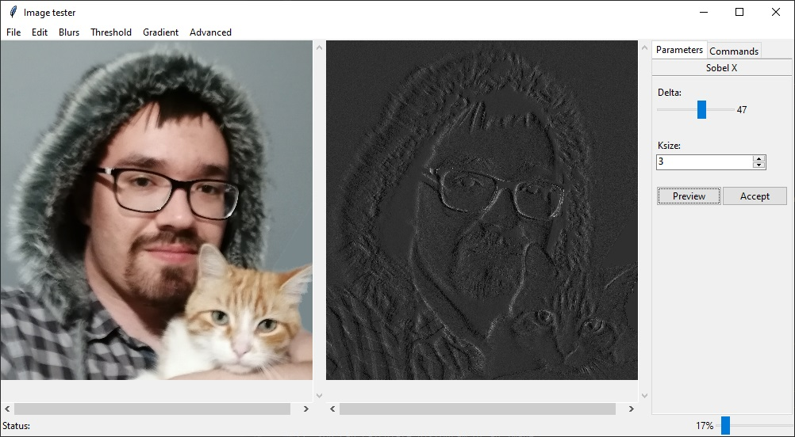

# Opencv image tester
## Introduction
This repository contains an application created by me (Marceli Sokólski) called Image Tester. The main goal of the
application is to provide user functionality to see **in real time** how images changes while user applies different 
filters using opencv imgproc module. In addition user is able to test whether opencv haar cascades or dlib face detector
detect face on an image he provided and processed.
## Download
Clone repository using 

    git clone https://github.com/Pralkopodobny/opencv_image_tester.git
    
    
## Installation
To run the program you have to install python (version 3 and greater) with additional libraries using command:

    pip install matplotlib opencv-python dlib numpy
To run program open console in program directory and type

    python ./app.py
## Project architecture
Application was designed according to Presentation Model design pattern (also known as MV). As a result there are classes 
which are part of graphical interface and classes which contains logic of the application. You can look at class 
diagram below:

##Usage

###Graphical interface
Graphical interface contains 6 sections (see image below)

    
1. Menu bar,
2. Left image which displays original (provided by user) image and shows face detection,
3. Right image which displays image after manipulation,
4. Status which displays warnings when something go wrong
5. Right menu which contains options to change parameters of used functions and history of changes (Commands option)
6. Scale which affects displayed images (note: application still stores them in original size to prevent quality drop)

###Functions
Application provides you options to:

1. Open your png or jpg files.
2. Save modified file. Program stores your modification history so you can choose which image you want to save 
and then use in your own application.
3. Undo previous change.
4. Rotate an image by 90, 180 or 270 degrees.
5. Convert image to grayscale.
6. Blur image using median, gaussian, averaging or bilateral filter.
7. Apply threshold to image (global, adaptive mean or gaussian thresholds are available).
8. Use gradients to detects edges.
9. Use Canny Edge Detection.
10. Test haar cascade to detect faces (or rather test whether faces on image are detectable by haar cascade 
after preprocessing)
11. Test dlib face detector with famous 68 face landmarks shape predictor 
(**NOTE: shape predictor is licenced for only educational usage and it is illegal to use it in commercial application.**
On [dlib github](https://github.com/davisking/dlib-models) you can find free to use but slightly worse versions).

12. You can calculate histogram of an image.

##Gallery

Face detected by opencv default haar cascade

Face detected by dlib face detector with 68 landmarks shape predictor

Image after applying grayscale and Sobel X gradient

Azunya after meny operations